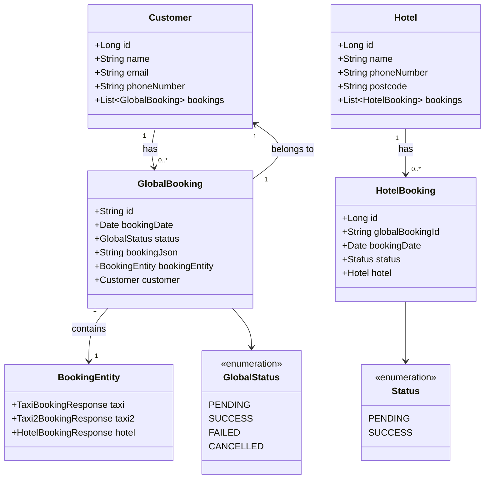
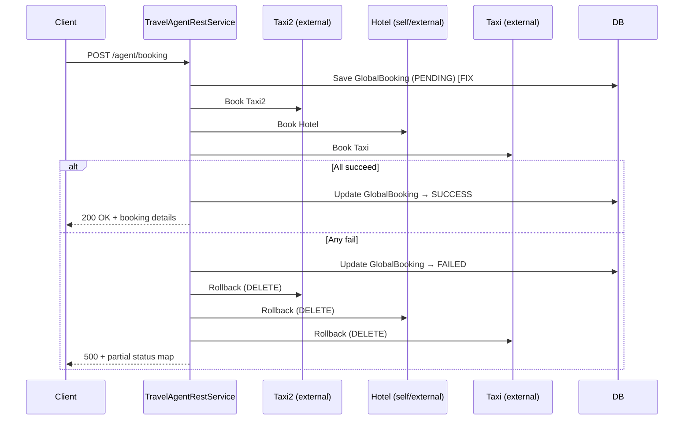

# CSC8104 Enterprise Middleware — Project Overview

> **Module**: CSC8104 Enterprise Middleware, Newcastle University
> **Author**: Swapnil Sagar
> **Framework**: [Quarkus](https://quarkus.io/) 2.10.3.Final
> **Language**: Java 11
> **Build Tool**: Apache Maven (via [mvnw](file:///d:/Enterprise/CSC8104/CSC8104-Swapnil-Sagar/mvnw) wrapper)

---

## 1. What Is This Project?

A **RESTful Enterprise Middleware** service built on the Quarkus framework. It manages:

- **Hotels** — CRUD for hotel records
- **Customers** — CRUD for customer records
- **Hotel Bookings** — booking a hotel room for a customer on a specific date
- **Travel Agent** — orchestrates a *global* cross-service booking (hotel + two external taxi services) with saga-style rollback on failure
- **Contacts** *(sample/starter code)* — example from the quickstart template

The application exposes its API via **JAX-RS** and is documented with **Swagger UI** at `http://localhost:8080/q/swagger-ui`.

---

## 2. Tech Stack

| Layer | Technology |
|---|---|
| Runtime | Quarkus 2.10.3.Final |
| Language | Java 11 |
| ORM | Hibernate ORM (JPA) |
| Database | H2 in-memory (dev/test) |
| Transactions | Narayana JTA |
| Validation | Hibernate Validator (Bean Validation) |
| REST Server | RESTEasy Reactive + Jackson |
| REST Client | MicroProfile REST Client (reactive) |
| API Docs | SmallRye OpenAPI + Swagger UI |
| Cloud Deploy | OpenShift (via `quarkus-openshift`) |
| Utilities | Lombok 1.18.34 |
| Testing | Quarkus JUnit5 + REST Assured |

---

## 3. Directory Structure

```
CSC8104-Swapnil-Sagar/
├── pom.xml                          # Maven build config
├── mvnw / mvnw.cmd                  # Maven wrapper scripts
├── .dockerignore / .gitignore
├── .s2i/                            # OpenShift Source-to-Image config
├── logs/                            # Runtime log output (application.log)
└── src/
    ├── main/
    │   ├── docker/                  # Dockerfile variants
    │   ├── resources/
    │   │   ├── application.properties   # All Quarkus config
    │   │   ├── import.sql               # Seed data on startup
    │   │   └── META-INF/resources/
    │   │       └── index.html           # Landing page
    │   └── java/uk/ac/newcastle/enterprisemiddleware/
    │       ├── Application.java         # Entry point (JAX-RS app)
    │       ├── DTO/                     # Data Transfer Objects
    │       ├── area/                    # Area code validation (external API)
    │       ├── contact/                 # Sample contact service (quickstart)
    │       ├── customer/                # Customer entity & REST
    │       ├── hotel/                   # Hotel entity & REST
    │       ├── hotelbooking/            # Hotel booking entity & REST
    │       ├── travelagent/             # Global booking / orchestration
    │       │   └── client/             # MicroProfile REST clients
    │       ├── repository/              # Shared repository base
    │       └── util/                   # Utilities (JSON, exceptions, etc.)
    └── test/
        └── java/...                    # Integration tests
```

---

## 4. Package Breakdown

### `customer`
| File | Role |
|---|---|
| [Customer.java](file:///d:/Enterprise/CSC8104/CSC8104-Swapnil-Sagar/src/main/java/uk/ac/newcastle/enterprisemiddleware/customer/Customer.java) | JPA Entity — [id](file:///d:/Enterprise/CSC8104/CSC8104-Swapnil-Sagar/src/test/java/uk/ac/newcastle/enterprisemiddleware/travelagent/TravelAgentRestServiceTest.java#80-107), `name`, `email`, `phoneNumber`, one-to-many [GlobalBooking](file:///d:/Enterprise/CSC8104/CSC8104-Swapnil-Sagar/src/main/java/uk/ac/newcastle/enterprisemiddleware/travelagent/GlobalBooking.java#20-153) |
| [CustomerRepository.java](file:///d:/Enterprise/CSC8104/CSC8104-Swapnil-Sagar/src/main/java/uk/ac/newcastle/enterprisemiddleware/customer/CustomerRepository.java) | Panache-style JPA repository |
| [CustomerService.java](file:///d:/Enterprise/CSC8104/CSC8104-Swapnil-Sagar/src/main/java/uk/ac/newcastle/enterprisemiddleware/customer/CustomerService.java) | Business logic (create, delete, lookup) |
| [CustomerRestService.java](file:///d:/Enterprise/CSC8104/CSC8104-Swapnil-Sagar/src/main/java/uk/ac/newcastle/enterprisemiddleware/customer/CustomerRestService.java) | REST endpoints under `/customers` |
| [CustomerMapper.java](file:///d:/Enterprise/CSC8104/CSC8104-Swapnil-Sagar/src/main/java/uk/ac/newcastle/enterprisemiddleware/customer/CustomerMapper.java) | Entity ↔ DTO mapping |

### `hotel`
| File | Role |
|---|---|
| [Hotel.java](file:///d:/Enterprise/CSC8104/CSC8104-Swapnil-Sagar/src/main/java/uk/ac/newcastle/enterprisemiddleware/hotel/Hotel.java) | JPA Entity — [id](file:///d:/Enterprise/CSC8104/CSC8104-Swapnil-Sagar/src/test/java/uk/ac/newcastle/enterprisemiddleware/travelagent/TravelAgentRestServiceTest.java#80-107), `name`, `phoneNumber` (unique), `postcode`, one-to-many [HotelBooking](file:///d:/Enterprise/CSC8104/CSC8104-Swapnil-Sagar/src/main/java/uk/ac/newcastle/enterprisemiddleware/hotelbooking/HotelBooking.java#19-129) |
| [HotelRepository.java](file:///d:/Enterprise/CSC8104/CSC8104-Swapnil-Sagar/src/main/java/uk/ac/newcastle/enterprisemiddleware/hotel/HotelRepository.java) | JPA repository |
| [HotelService.java](file:///d:/Enterprise/CSC8104/CSC8104-Swapnil-Sagar/src/main/java/uk/ac/newcastle/enterprisemiddleware/hotel/HotelService.java) | Business logic |
| [HotelRestService.java](file:///d:/Enterprise/CSC8104/CSC8104-Swapnil-Sagar/src/main/java/uk/ac/newcastle/enterprisemiddleware/hotel/HotelRestService.java) | REST endpoints under `/hotel` |
| [HotelMapper.java](file:///d:/Enterprise/CSC8104/CSC8104-Swapnil-Sagar/src/main/java/uk/ac/newcastle/enterprisemiddleware/hotel/HotelMapper.java) | Entity ↔ DTO mapping |
| [HotelNotFoundException.java](file:///d:/Enterprise/CSC8104/CSC8104-Swapnil-Sagar/src/main/java/uk/ac/newcastle/enterprisemiddleware/hotel/HotelNotFoundException.java) | Custom exception |

### `hotelbooking`
| File | Role |
|---|---|
| [HotelBooking.java](file:///d:/Enterprise/CSC8104/CSC8104-Swapnil-Sagar/src/main/java/uk/ac/newcastle/enterprisemiddleware/hotelbooking/HotelBooking.java) | JPA Entity — [id](file:///d:/Enterprise/CSC8104/CSC8104-Swapnil-Sagar/src/test/java/uk/ac/newcastle/enterprisemiddleware/travelagent/TravelAgentRestServiceTest.java#80-107), `hotel` (FK), `bookingDate`, `globalBookingId`, `status` (PENDING/SUCCESS) |
| [HotelBookingRepository.java](file:///d:/Enterprise/CSC8104/CSC8104-Swapnil-Sagar/src/main/java/uk/ac/newcastle/enterprisemiddleware/hotelbooking/HotelBookingRepository.java) | JPA repository |
| [HotelBookingService.java](file:///d:/Enterprise/CSC8104/CSC8104-Swapnil-Sagar/src/main/java/uk/ac/newcastle/enterprisemiddleware/hotelbooking/HotelBookingService.java) | Booking logic with conflict/date validation |
| [HotelBookingRestService.java](file:///d:/Enterprise/CSC8104/CSC8104-Swapnil-Sagar/src/main/java/uk/ac/newcastle/enterprisemiddleware/hotelbooking/HotelBookingRestService.java) | REST endpoints under `/hotel-booking` |
| [HotelBookingRequest.java](file:///d:/Enterprise/CSC8104/CSC8104-Swapnil-Sagar/src/main/java/uk/ac/newcastle/enterprisemiddleware/hotelbooking/HotelBookingRequest.java) | Request DTO |
| [HotelBookingMapper.java](file:///d:/Enterprise/CSC8104/CSC8104-Swapnil-Sagar/src/main/java/uk/ac/newcastle/enterprisemiddleware/hotelbooking/HotelBookingMapper.java) | Entity ↔ DTO |
| [Status.java](file:///d:/Enterprise/CSC8104/CSC8104-Swapnil-Sagar/src/main/java/uk/ac/newcastle/enterprisemiddleware/hotelbooking/Status.java) | Enum: `PENDING`, `SUCCESS` |
| `exception/` | `BookingDateConflictException`, `InvalidBookingDateException` |

### `travelagent`
| File | Role |
|---|---|
| [GlobalBooking.java](file:///d:/Enterprise/CSC8104/CSC8104-Swapnil-Sagar/src/main/java/uk/ac/newcastle/enterprisemiddleware/travelagent/GlobalBooking.java) | JPA Entity — [id](file:///d:/Enterprise/CSC8104/CSC8104-Swapnil-Sagar/src/test/java/uk/ac/newcastle/enterprisemiddleware/travelagent/TravelAgentRestServiceTest.java#80-107) (UUID string), `customer` (FK), `bookingDate`, `bookingJson` (serialized [BookingEntity](file:///d:/Enterprise/CSC8104/CSC8104-Swapnil-Sagar/src/main/java/uk/ac/newcastle/enterprisemiddleware/travelagent/BookingEntity.java#16-61)), `status` |
| [GlobalBookingService.java](file:///d:/Enterprise/CSC8104/CSC8104-Swapnil-Sagar/src/main/java/uk/ac/newcastle/enterprisemiddleware/travelagent/GlobalBookingService.java) | Persists/fetches global bookings |
| [GlobalBookingRepository.java](file:///d:/Enterprise/CSC8104/CSC8104-Swapnil-Sagar/src/main/java/uk/ac/newcastle/enterprisemiddleware/travelagent/GlobalBookingRepository.java) | JPA repository |
| [GlobalBookingRequest.java](file:///d:/Enterprise/CSC8104/CSC8104-Swapnil-Sagar/src/main/java/uk/ac/newcastle/enterprisemiddleware/travelagent/GlobalBookingRequest.java) | Incoming booking request (customerId + date + hotel/taxi IDs) |
| [GuestBookingRequest.java](file:///d:/Enterprise/CSC8104/CSC8104-Swapnil-Sagar/src/main/java/uk/ac/newcastle/enterprisemiddleware/travelagent/GuestBookingRequest.java) | Like above but also creates the customer on the fly |
| [BookingEntity.java](file:///d:/Enterprise/CSC8104/CSC8104-Swapnil-Sagar/src/main/java/uk/ac/newcastle/enterprisemiddleware/travelagent/BookingEntity.java) | Snapshot of sub-bookings: `taxi`, `taxi2`, `hotel` responses |
| [GlobalStatus.java](file:///d:/Enterprise/CSC8104/CSC8104-Swapnil-Sagar/src/main/java/uk/ac/newcastle/enterprisemiddleware/travelagent/GlobalStatus.java) | Enum: `PENDING`, `SUCCESS`, `FAILED`, `CANCELLED` |
| [TravelAgentRestService.java](file:///d:/Enterprise/CSC8104/CSC8104-Swapnil-Sagar/src/main/java/uk/ac/newcastle/enterprisemiddleware/travelagent/TravelAgentRestService.java) | Orchestration endpoints under `/agent` |
| [client/HotelClient.java](file:///d:/Enterprise/CSC8104/CSC8104-Swapnil-Sagar/src/main/java/uk/ac/newcastle/enterprisemiddleware/travelagent/client/HotelClient.java) | REST client → this service's own `/hotel-booking` (self-call, used cross-service) |
| `client/TaxiClient.java` | REST client → external Taxi service 1 |
| `client/Taxi2Client.java` | REST client → external Taxi service 2 |

### [DTO](file:///d:/Enterprise/CSC8104/CSC8104-Swapnil-Sagar/src/main/java/uk/ac/newcastle/enterprisemiddleware/hotel/HotelMapper.java#32-50)
| DTO | Purpose |
|---|---|
| [CustomerDTO](file:///d:/Enterprise/CSC8104/CSC8104-Swapnil-Sagar/src/main/java/uk/ac/newcastle/enterprisemiddleware/DTO/CustomerDTO.java#10-63) | Customer response |
| `HotelDTO` | Hotel response |
| `HotelBookingDTO` | Hotel booking response |
| `CustomerBookMapDTO` | Maps customer → their bookings |
| `HotelBookMapDTO` | Maps hotel → its bookings |

### `contact` *(starter code)*
The original quickstart example — not the primary coursework implementation, but retained. Demonstrates the same layered pattern.

---

## 5. UML Class Diagram



---

## 6. REST API Endpoints

### Customer — `/customers`
| Method | Path | Description |
|---|---|---|
| GET | `/customers/` | Get all customers |
| GET | `/customers/{id}` | Get customer by ID |
| POST | `/customers/` | Create a customer (returns [CustomerDTO](file:///d:/Enterprise/CSC8104/CSC8104-Swapnil-Sagar/src/main/java/uk/ac/newcastle/enterprisemiddleware/DTO/CustomerDTO.java#10-63)) |
| PUT | `/customers/{id}` | Update a customer *(added in fix #2)* |
| DELETE | `/customers/{id}` | Delete a customer |

### Hotel — `/hotel`
| Method | Path | Description |
|---|---|---|
| GET | `/hotel/` | Get all hotels |
| GET | `/hotel/{id}` | Get hotel by ID |
| POST | `/hotel/` | Create a hotel (returns `HotelDTO`) |
| PUT | `/hotel/{id}` | Update a hotel *(added in fix #2)* |
| DELETE | `/hotel/{id}` | Delete a hotel |

### Hotel Booking — `/hotel-booking`
| Method | Path | Description |
|---|---|---|
| GET | `/hotel-booking/` | Get all bookings |
| POST | `/hotel-booking/` | Create a booking |
| DELETE | `/hotel-booking/{bookingId}` | Delete by local ID |
| DELETE | `/hotel-booking/{globalBookingId}` | Delete by global booking ID |

### Travel Agent — `/agent`
| Method | Path | Description |
|---|---|---|
| GET | `/agent/` | Get all global bookings |
| POST | `/agent/booking` | Make a global booking (existing customer) |
| POST | `/agent/guest-booking` | Make a global booking + auto-create customer |
| DELETE | `/agent/cancel/{globalBookingId}` | Cancel global booking + rollback all sub-bookings |
| DELETE | `/agent/{customerId}` | Delete customer and cancel all their bookings |

---

## 7. Travel Agent Saga Workflow



---

## 8. Configuration ([application.properties](file:///d:/Enterprise/CSC8104/CSC8104-Swapnil-Sagar/src/main/resources/application.properties))

| Key | Value |
|---|---|
| HTTP port | `8080` |
| Database | H2 in-memory (`jdbc:h2:mem:default`) |
| Schema generation | `drop-and-create` (recreated on every startup) |
| Swagger UI | Always enabled at `/q/swagger-ui` |
| Log file | [logs/application.log](file:///d:/Enterprise/CSC8104/CSC8104-Swapnil-Sagar/logs/application.log) (10 MB rotation, 5 backups) |
| External Taxi 1 | `https://csc-8104-mayank-kunwar-crt-...openshiftapps.com` |
| External Taxi 2 | `https://csc-8104-deepal-thakur-...openshiftapps.com` |
| Hotel (self) | `https://csc-8104-swapnil-sagar-...openshiftapps.com` |
| Area API | `http://100.26.55.42:80/` |

---

## 9. How to Execute

### Prerequisites
- Java 11 JDK installed and on `PATH`
- Maven (or use included [mvnw](file:///d:/Enterprise/CSC8104/CSC8104-Swapnil-Sagar/mvnw) wrapper — no install needed)

### Run in Dev Mode (Recommended — Hot Reload)
```powershell
# From the project root
.\mvnw compile quarkus:dev -D"net.bytebuddy.experimental"
```
- App runs at **http://localhost:8080**
- Swagger UI: **http://localhost:8080/q/swagger-ui**
- Quarkus Dev UI: **http://localhost:8080/q/dev/**

### Run Tests
```powershell
.\mvnw test
```

### Run Integration Tests
```powershell
.\mvnw verify -DskipITs=false
```

### Build a JAR
```powershell
.\mvnw package
# Output: target/csc8104-1.0.0-SNAPSHOT-runner.jar
java -jar target/csc8104-1.0.0-SNAPSHOT-runner.jar
```

### Build Native (GraalVM required)
```powershell
.\mvnw package -Pnative
```

---

## 10. Key Design Decisions

| Decision | Rationale |
|---|---|
| **H2 in-memory DB** | Simple setup for coursework; schema drops & recreates on every restart |
| **Saga pattern in Travel Agent** | [GlobalBooking](file:///d:/Enterprise/CSC8104/CSC8104-Swapnil-Sagar/src/main/java/uk/ac/newcastle/enterprisemiddleware/travelagent/GlobalBooking.java#20-153) is always persisted as `PENDING` before sub-bookings, then updated to `SUCCESS`/`FAILED`. Guarantees an audit record exists even on partial failures. Cancellation failures per-service are reported back to the caller (not silently swallowed). |
| **`bookingJson` (TEXT column)** | [BookingEntity](file:///d:/Enterprise/CSC8104/CSC8104-Swapnil-Sagar/src/main/java/uk/ac/newcastle/enterprisemiddleware/travelagent/BookingEntity.java#16-61) (taxi/hotel responses) stored as JSON string — avoids extra join tables |
| **GlobalBooking ID = UUID string** | Correlates bookings across independent external services |
| **DTO separation** | Entities are not exposed directly; DTOs decouple API from persistence model |
| **`@JsonManagedReference` / `@JsonBackReference`** | Prevents infinite recursion in bidirectional relationships during serialisation |
